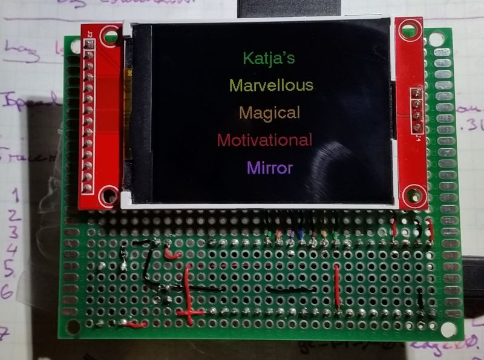
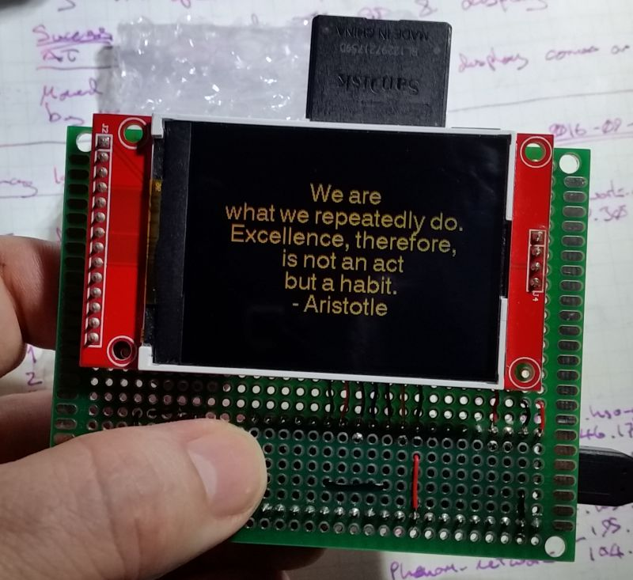
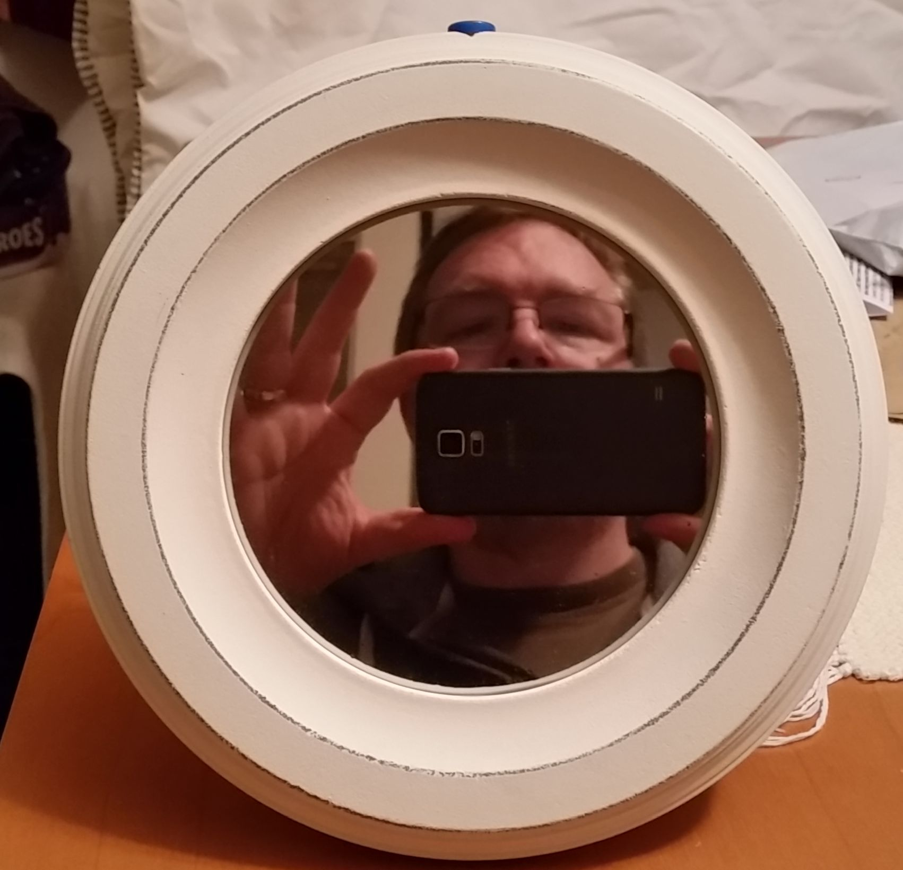
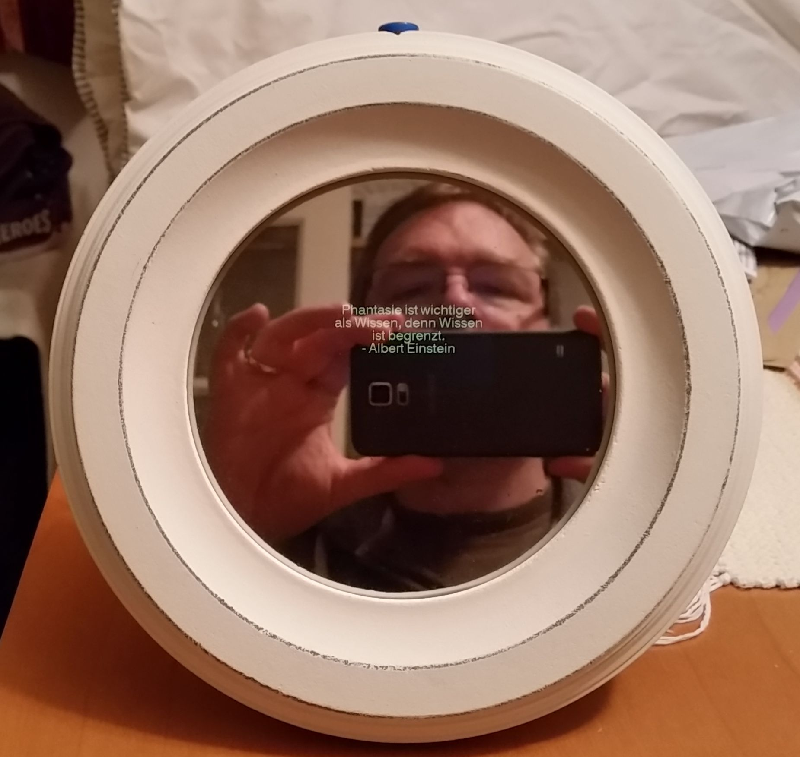
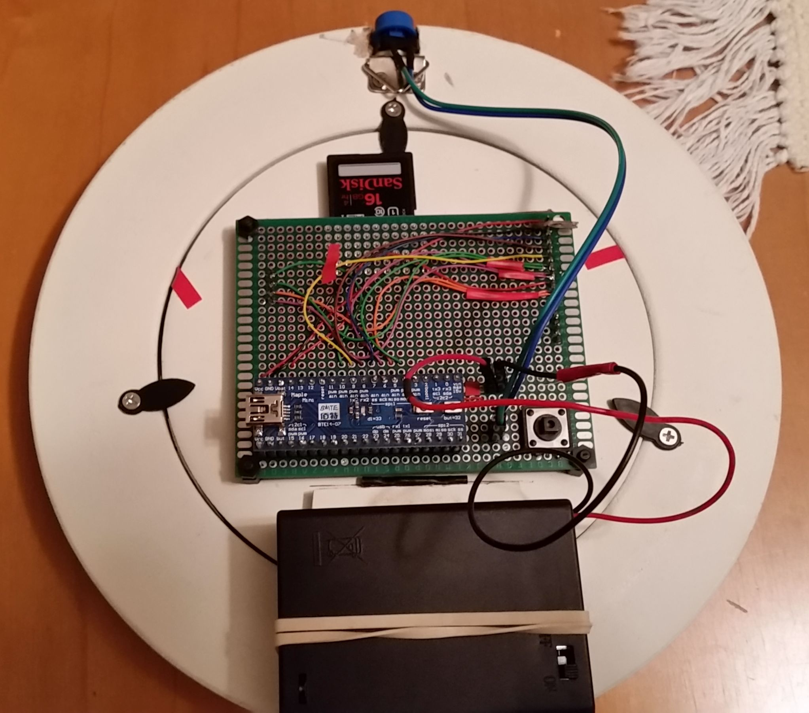
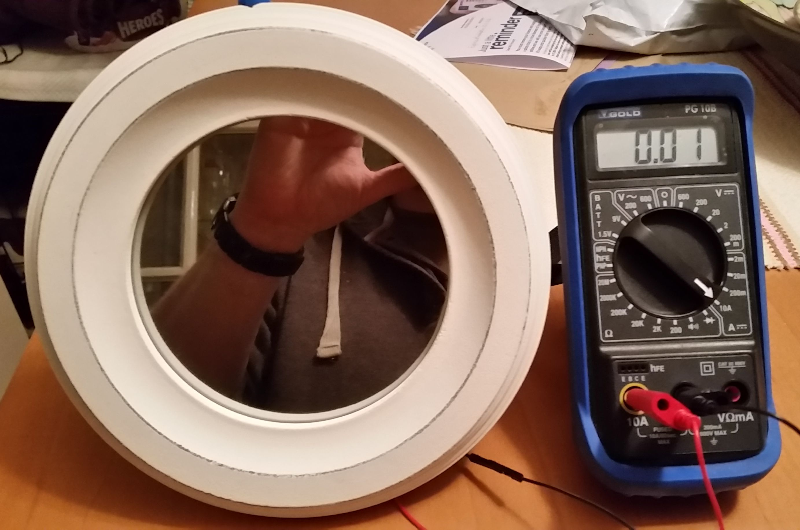
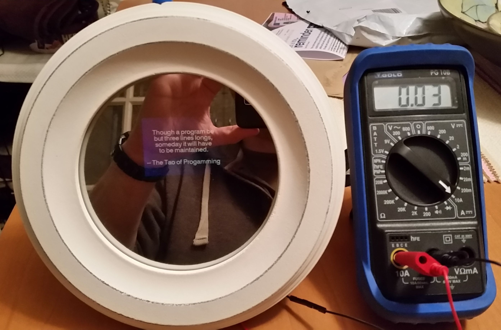

# Katja's Mirror

## Introduction

My friend Katja loves inspirational quotes. Loves them. All the time, on the 
facebook with the inspirational quotes.

This project is to make a 'magic mirror' - essentially, a small picture frame 
with one-way mirror glass, a small microcontroller board, TFT display and SD
memory card that will deliver an inspirational quote at the touch of a button.

## Hardware

Components            | Src | Cost  | Notes
----------------------|-----|-------|---------------------------------------------
Maple Leaf Mini       | 1   | £2.81 | STM32 32-bit ARM cortex-M3, 120KB/4KB
240x320 SPI TFT LCD   | 1   | £2.99 | ILI9341 display, SD card reader 
Prototype board       | ?   | ?     | 7cm x 9cm 
Two buttons           | 1   | ?     | From a pack of components
3 x AA battery holder | 2   | £3.51 | Has an on/off switch - 2 x AA would work
Picture/Photo Frame   | 2   | £6.79 | MDF Picture/Photo Frame, 12.5cm Diameter
One-way mirror film   | 2   | £5.99 | 50 x 100cm - still got loads left
SD Card (8Mb)         | ?   | ?     | An old one I had lying around

### Sources
1. Ebay.co.uk
2. amazon.co.uk

## Construction and Finished Product

Initial protoboard lash-up showing the startup screen.

The test button on the back will then display a quote.

Here you can see the mirror when in-active (screen off, deep sleep). Yes, that 
handsome beast behind the camera is me. The reflection is quite dark but 
servicable.

When the button on top is pressed, a quote is displayed for ~7-seconds.

Here you can see the gubbins on the back. The button on the board can also be
used to trigger a quote to be displayed and the button cunningly stuck/wedged
into the top of the picture frame is connected by header pins. The battery back
is held to the frame stand by an elastic band (no expense spared).

In deep sleep, the system consumes ~10 mA, which means it should last about a 
week - not that great.

When active, it consumes ~30 to 50 mA. 

## User Instructions

I used a bit of python to ensure the formatting of the quotes. I wrote one
great cut and paste quote file and then used the script to split this into 
correctly formatted individual quote files. 

Each quote file has the name 'FILE####.txt'. 

The SD card has and SD Ardino library only support 8.3 filenames. The sketch 
only selects filenames that start 'FILE', everything else is ignored.

The quotes served up are psuedo random. When reading the next quote file in, 
the code will randomly skip 1 to 5 files so that after switching on the 
quotes seem a little randomised. 

Pressing the Maple Mini User button within 3-seconds of the welcome message 
"Katja's Magical Marvelous Motivational Mirror" will put the system into test
mode, in which it displays each message one after the other, and indicates the
quote file name for each as well. Useful for debugging.

After the Welcome message is displayed, the first button press displays an
initial quote from the Tao of programming, that is hard coded. After that, each
button press reads a quote file and displays it.

## Interesting Issues

The font library is very limited and trying to display a character not in the font
will crash the sketch :( Had to be careful with the German quotes not to use
any umlats!

I glued the button into the frame with Gorilla glue - which got into the button
(despite it being wrapped in tape) and caused a short - that was annoying and 
difficult to diagnose. 

Had to make the input button a pulldown input to work reliably - that is probably
costing some current.

Also, the TFT panel logic is on (although not the display LED) - maybe that could
be powered up each time.

Putting the Maple Mini in to deep sleep and then waking it up again makes it run
really slow - which is not a problem - some kind of clock setting issue but it
works for my application so I didn't try and fix it.

